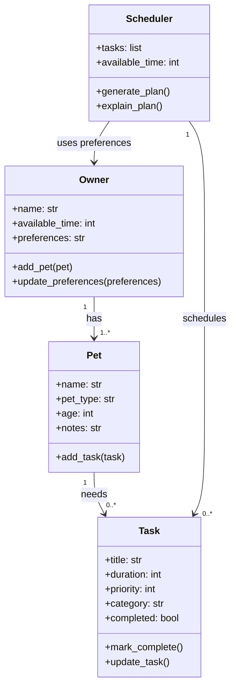

# PawPal+ Project Reflection

## 1. System Design

**a. Initial design**

My initial design focused on three main things the user should be able to do in PawPal+:

- Add their pet and basic owner information so the app knows who the plan is for.
- Create and update care tasks like walks, feeding, medication, or grooming.
- View a daily plan that shows what should be done today based on time and priority.

The four main classes I chose were `Owner`, `Pet`, `Task`, and `Scheduler`.

- `Owner` holds the owner's name, available time, and preferences. It can add a pet and update preferences.
- `Pet` holds the pet's name, type, age, and notes. It can store tasks for that pet.
- `Task` holds the task name, duration, priority, category, and whether it is done. It can be marked complete or updated.
- `Scheduler` holds the list of tasks and time constraints. It can generate a daily plan and explain why tasks were chosen.

This was the Mermaid class diagram I would start with:

**b. Design changes**

I expect the design may change a little during implementation, especially if the scheduling logic needs more detail. For example, I might split scheduling rules into a separate helper if the `Scheduler` class starts doing too much.

---

## 2. Scheduling Logic and Tradeoffs

**a. Constraints and priorities**

- What constraints does your scheduler consider (for example: time, priority, preferences)?
- How did you decide which constraints mattered most?

**b. Tradeoffs**

- Describe one tradeoff your scheduler makes.
- Why is that tradeoff reasonable for this scenario?

---

## 3. AI Collaboration

**a. How you used AI**

- How did you use AI tools during this project (for example: design brainstorming, debugging, refactoring)?
- What kinds of prompts or questions were most helpful?

**b. Judgment and verification**

- Describe one moment where you did not accept an AI suggestion as-is.
- How did you evaluate or verify what the AI suggested?

---

## 4. Testing and Verification

**a. What you tested**

- What behaviors did you test?
- Why were these tests important?

**b. Confidence**

- How confident are you that your scheduler works correctly?
- What edge cases would you test next if you had more time?

---

## 5. Reflection

**a. What went well**

- What part of this project are you most satisfied with?

**b. What you would improve**

- If you had another iteration, what would you improve or redesign?

**c. Key takeaway**

- What is one important thing you learned about designing systems or working with AI on this project?
