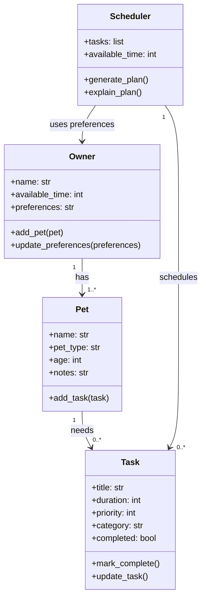

# PawPal+ Project Reflection

## 1. System Design

**a. Initial design**

My initial design used four main classes: `Owner`, `Pet`, `Task`, and `Scheduler`.

- `Owner` stores the owner's basic info, available time, and preferences.
- `Pet` stores information about each pet, like name, type, age, and notes.
- `Task` represents a care task such as feeding, walking, medication, or grooming, including its time, frequency, and completion status.
- `Scheduler` is responsible for retrieving tasks across pets and building a daily plan in a clear order.

I chose these classes because they matched the main parts of the problem: who the owner is, which pet needs care, what tasks need to be done, and how the app should decide what happens each day.

This was the Mermaid class diagram I would start with:

**b. Design changes**

After reviewing the skeleton, I realized the `Scheduler` should be connected more directly to the `Owner` instead of only receiving a plain list of tasks. That makes more sense because the schedule depends on the owner's available time and preferences, not just the tasks by themselves.

I also added a simple `get_tasks()` method to the `Pet` class so it is clearer how the scheduler could gather tasks from each pet. I made these changes to keep the relationships between the classes more natural and to avoid forcing too much logic into one place later.

---

## 2. Scheduling Logic and Tradeoffs

**a. Constraints and priorities**

My scheduler mainly considers task time, due date, completion status, and recurrence. It also keeps owner and pet information connected so tasks can be grouped and filtered in a way that makes sense in the UI.

I decided time and completion status mattered most because those were the clearest rules needed to build a useful daily plan. After that, recurrence and conflict warnings helped make the app feel smarter without making the logic too complicated too early.

**b. Tradeoffs**

One tradeoff my scheduler makes is that conflict detection only checks for exact matching times instead of full overlaps based on task duration. For example, it will catch two tasks both scheduled at 7:30 AM, but it will not notice that a 30-minute task at 7:30 AM overlaps with another task at 7:45 AM.

I think this tradeoff is reasonable for this version of the project because it keeps the logic simple and easy to understand while still catching obvious scheduling problems. If I had more time, I would expand it to compare task durations and detect partial overlaps too.

---

## 3. AI Collaboration

**a. How you used AI**

I used AI mostly for brainstorming class design, checking method ideas, drafting tests, and refining the scheduler logic. The most helpful Copilot features were chat for planning, inline suggestions for small method changes, and using separate chat sessions for different phases like design, algorithms, and testing.

The most helpful prompts were specific ones tied to my actual files, like asking how the `Scheduler` should retrieve tasks from the `Owner`, how to sort task objects by time, or what edge cases mattered most for recurring tasks and conflict detection.

**b. Judgment and verification**

One example was conflict detection. A more advanced version could have compared overlapping durations and built a more complex scheduling engine, but I chose to keep the lighter version that only checks exact matching times. That fit the scope of the project better and kept the code easier to explain.

I also adjusted suggestions when they looked more clever than readable. I verified changes by running `main.py`, checking the Streamlit flow, and making sure the automated tests still passed before keeping them.

---

## 4. Testing and Verification

**a. What you tested**

I tested task completion, adding tasks to a pet, sorting tasks in chronological order, filtering tasks by pet, daily recurrence, conflict detection, empty schedules, and non-recurring task completion.

These tests were important because they covered both the basic class behavior and the main scheduler logic. They helped me confirm that the app was not just storing data, but actually organizing and updating tasks correctly.

**b. Confidence**

I feel fairly confident in the scheduler for the current scope, especially because the core behaviors are covered by passing tests and the CLI demo matches what the UI is supposed to do. I would rate my confidence around 4 out of 5.

If I had more time, I would test invalid time formats, overlapping tasks with durations, duplicate pet names, and larger schedules with many pets and recurring tasks happening across several days.

---

## 5. Reflection

**a. What went well**

The part I am most satisfied with is how the system stayed organized as it grew. Starting with separate classes made it much easier to add smarter scheduling features later without completely rewriting the app.

**b. What you would improve**

If I had another iteration, I would improve the scheduler to handle real time overlaps instead of only exact time matches. I would also make the UI better for editing and completing tasks directly from the schedule table.

**c. Key takeaway**

One important thing I learned is that using AI well still requires human direction. Copilot was helpful for speed, but I still had to act like the lead architect by deciding what belonged in the design, what was too complex for the assignment, and when a simpler solution was better.

Using separate chat sessions for different phases also helped a lot because it kept the design questions, algorithm ideas, and testing work from all blending together. That made it easier to stay focused and make better decisions.
