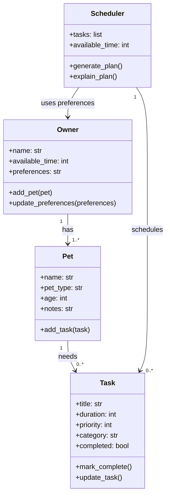

# PawPal+ Project Reflection

## 1. System Design

**a. Initial design**

My initial design used four main classes: `Owner`, `Pet`, `Task`, and `Scheduler`.

- `Owner` stores the owner's basic info, available time, and preferences.
- `Pet` stores information about each pet, like name, type, age, and notes.
- `Task` represents a care task such as feeding, walking, medication, or grooming, including its time, frequency, and completion status.
- `Scheduler` is responsible for retrieving tasks across pets and building a daily plan in a clear order.

I chose these classes because they matched the main parts of the problem: who the owner is, which pet needs care, what tasks need to be done, and how the app should decide what happens each day.

This was the Mermaid class diagram I would start with:

**b. Design changes**

After reviewing the skeleton, I realized the `Scheduler` should be connected more directly to the `Owner` instead of only receiving a plain list of tasks. That makes more sense because the schedule depends on the owner's available time and preferences, not just the tasks by themselves.

I also added a simple `get_tasks()` method to the `Pet` class so it is clearer how the scheduler could gather tasks from each pet. I made these changes to keep the relationships between the classes more natural and to avoid forcing too much logic into one place later.

---

## 2. Scheduling Logic and Tradeoffs

**a. Constraints and priorities**

- What constraints does your scheduler consider (for example: time, priority, preferences)?
- How did you decide which constraints mattered most?

**b. Tradeoffs**

- Describe one tradeoff your scheduler makes.
- Why is that tradeoff reasonable for this scenario?

---

## 3. AI Collaboration

**a. How you used AI**

- How did you use AI tools during this project (for example: design brainstorming, debugging, refactoring)?
- What kinds of prompts or questions were most helpful?

**b. Judgment and verification**

- Describe one moment where you did not accept an AI suggestion as-is.
- How did you evaluate or verify what the AI suggested?

---

## 4. Testing and Verification

**a. What you tested**

- What behaviors did you test?
- Why were these tests important?

**b. Confidence**

- How confident are you that your scheduler works correctly?
- What edge cases would you test next if you had more time?

---

## 5. Reflection

**a. What went well**

- What part of this project are you most satisfied with?

**b. What you would improve**

- If you had another iteration, what would you improve or redesign?

**c. Key takeaway**

- What is one important thing you learned about designing systems or working with AI on this project?
